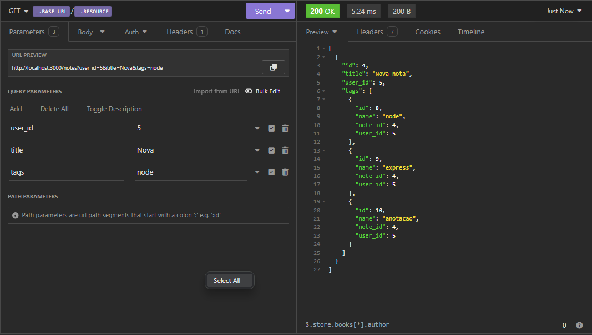
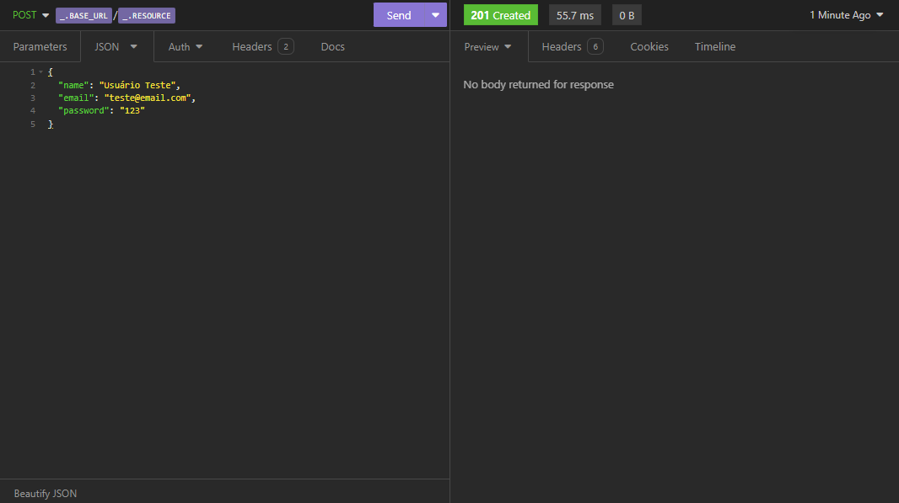

# Node API

Uma API desenvolvido em Node.JS para entrar de cabeça no mundo do backend.

Neste projeto temos:
 - Criação de usuário;
 - Atualização de senha;
 - Criação de uma nota com tags e links vinculados;
 - Listagem de Notas com filtros;
 - Listagem de tags;

O projeto tem o intuíto de mostrar como uma API deve funcionar, utilizando uma boa stack.

O projeto acompanha como complementos **Knex**, **NodeMon** e **Express**, utilizando também um banco de dados relacional criado em **SQLite**.

A parte do DB foi criada utilizando migrations a fins de versionamento do banco.

## Screenshots

## Tech Stack

**Client:** Insomnia

**Server:** Node, Express

## Authors

- [@gabrielsouzaleite](https://github.com/gabrielsouzaleite)

